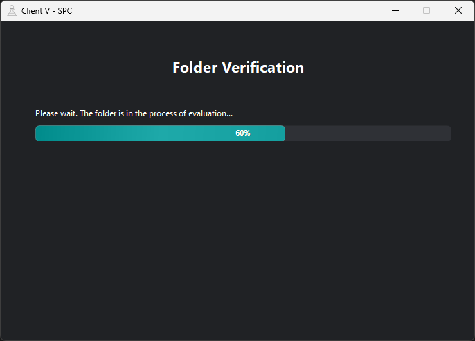
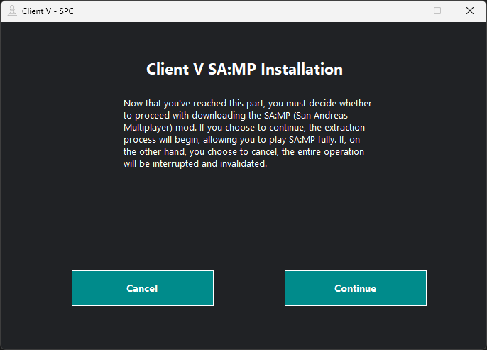

# clients-samp

[](https://opensource.org/licenses/Apache-2.0)
[](https://docs.microsoft.com/en-us/dotnet/csharp/)
[](https://dotnet.microsoft.com/)
[](https://docs.microsoft.com/en-us/dotnet/desktop/winforms/)

Este repositório contém o código-fonte de vários instaladores de Client SA:MP (San Andreas Multiplayer) desenvolvidos pela SPC (SA-MP Programming Community). Esses instaladores foram criados para fornecer alternativas seguras e confiáveis aos instaladores originais do mod, que não são mais considerados confiáveis.

## Idiomas

- Deutsch: [README](translations/Deutsch/README.md)
- English: [README](translations/English/README.md)
- Español: [README](translations/Espanol/README.md)
- Français: [README](translations/Francais/README.md)
- Italiano: [README](translations/Italiano/README.md)
- Polski: [README](translations/Polski/README.md)
- Русский: [README](translations/Русский/README.md)
- Svenska: [README](translations/Svenska/README.md)
- Türkçe: [README](translations/Turkce/README.md)

## Índice

- [clients-samp](#clients-samp)
  - [Idiomas](#idiomas)
  - [Índice](#índice)
  - [Visão Geral](#visão-geral)
  - [Versões Disponíveis](#versões-disponíveis)
  - [Estrutura do Projeto](#estrutura-do-projeto)
  - [Funcionalidades](#funcionalidades)
  - [Instalação](#instalação)
  - [Compilação](#compilação)
    - [Pré-requisitos](#pré-requisitos)
    - [Como compilar](#como-compilar)
  - [Estrutura do Código e Componentes](#estrutura-do-código-e-componentes)
    - [Componentes Principais](#componentes-principais)
      - [Client Instalador (`InstallerClient.cs`)](#client-instalador-installerclientcs)
    - [Serviços](#serviços)
      - [Serviço de Extração de Arquivos (`FileExtraction.cs`)](#serviço-de-extração-de-arquivos-fileextractioncs)
      - [Suporte a Idiomas (`Language.cs`)](#suporte-a-idiomas-languagecs)
      - [Serviço de Mapeamento de Idiomas (`LanguageMapping.cs`)](#serviço-de-mapeamento-de-idiomas-languagemappingcs)
      - [Serviço de Redes Sociais (`SocialNetworks.cs`)](#serviço-de-redes-sociais-socialnetworkscs)
      - [Componentes de Interface Personalizados](#componentes-de-interface-personalizados)
        - [Barra de Progresso (`CustomProgressBar.cs`)](#barra-de-progresso-customprogressbarcs)
        - [Cores do Tema (`Colors.cs`)](#cores-do-tema-colorscs)
    - [Recursos de Segurança](#recursos-de-segurança)
      - [Privilégios Administrativos](#privilégios-administrativos)
      - [Assinatura de Assembly](#assinatura-de-assembly)
    - [Internacionalização](#internacionalização)
      - [Sistema de Tradução](#sistema-de-tradução)
      - [Ícones de Bandeiras](#ícones-de-bandeiras)
  - [Configuração do Projeto (.csproj)](#configuração-do-projeto-csproj)
    - [Configurações Básicas](#configurações-básicas)
    - [Informações da Versão e Empresa](#informações-da-versão-e-empresa)
    - [Configurações de Runtime](#configurações-de-runtime)
    - [Recursos Incorporados](#recursos-incorporados)
    - [Observações Importantes](#observações-importantes)
  - [Screenshots](#screenshots)
  - [Licença](#licença)
    - [Termos e Condições de Uso](#termos-e-condições-de-uso)
      - [1. Permissões Concedidas](#1-permissões-concedidas)
      - [2. Condições Obrigatórias](#2-condições-obrigatórias)
      - [3. Restrições e Limitações](#3-restrições-e-limitações)
      - [4. Propriedade Intelectual](#4-propriedade-intelectual)
      - [5. Isenção de Garantias e Limitação de Responsabilidade](#5-isenção-de-garantias-e-limitação-de-responsabilidade)

## Visão Geral

O projeto tem como objetivo fornecer instaladores seguros e confiáveis para diferentes versões do mod SA:MP. Cada instalador é desenvolvido em C# usando Windows Forms, oferecendo uma interface moderna e amigável com suporte a múltiplos idiomas e uma janela com as redes sociais.

## Versões Disponíveis

O repositório inclui as seguintes versões de Client:

- `samp-client-dl-r1`: Instalador do Client DL R1
- `samp-client-r1`: Instalador do Client R1
- `samp-client-r1-voip`: Client R1 com integração SAMPVOICE
- `samp-client-r2`: Instalador do Client R2
- `samp-client-r3`: Instalador do Client R3
- `samp-client-r3-voip`: Client R3 com integração SAMPVOICE
- `samp-client-r4`: Instalador do Client R4
- `samp-client-r5`: Instalador do Client R5

## Estrutura do Projeto

Cada versão do Client segue uma estrutura de projeto consistente:

```
clients-samp/
└── samp-client-v/
    ├── archives/
    │   └── samp-client-{v}.zip
    ├── icons/
    │   ├── languages/
    │   │   └── [ícones de bandeiras dos idiomas]
    │   └── social/
    │       └── [ícones de redes sociais]
    ├── src/
    │   ├── Core/
    │   │   └── InstallerClient.cs
    │   ├── Models/
    │   │   └── Colors.cs
    │   ├── Services/
    │   │   ├── FileExtraction.cs
    │   │   ├── Language.cs
    │   │   ├── LanguageMapping.cs
    │   │   └── SocialNetworks.cs
    │   └── UI/
    │       └── CustomProgressBar.cs
    ├── translations/
    │   └── [30 arquivos XML de idiomas]
    ├── adm.manifest
    ├── compile.bat
    ├── Main.cs
    └── samp-client-{v}.csproj
```

## Funcionalidades

- Suporte a múltiplos idiomas (30 idiomas)
- Interface de usuário moderna e intuitiva
- Extração e instalação segura de arquivos
- Validação do diretório do jogo
- Acompanhamento do progresso em tempo real
- Janela com as redes sociais
- Assinatura de assembly opcional para segurança aprimorada
- Barra de progresso personalizada com animações
- Esquema de cores e estilo consistentes

## Instalação

1. Acesse a página de [releases](https://github.com/spc-samp/clients-samp/releases) do projeto
2. Baixe a versão mais recente do Client já compilada
3. Execute e prossiga para os procedimentos

## Compilação

### Pré-requisitos

- SDK .NET 9.0 ou superior
- Sistema operacional Windows
- Visual Studio 2022 ou superior (opcional)
- Visual Studio Code (opcional)

### Como compilar

A maneira mais fácil de compilar qualquer versão do Client é usando o arquivo batch fornecido:

1. Abra um terminal no diretório da versão do Client
2. Execute o comando de compilação:
```bash
.\compile
```

Você também pode compilar diretamente usando o CLI do .NET:
```bash
dotnet publish -c Release -r win-x64 --self-contained true -p:PublishSingleFile=true -p:EnableCompressionInSingleFile=true -o ./published
```

> [!NOTE]
> Este comando irá gerar um arquivo executável único e otimizado para Windows 64-bit, contendo todas as dependências necessárias. O executável será criado dentro da pasta `published` no diretório do projeto.

## Estrutura do Código e Componentes

### Componentes Principais

#### Client Instalador (`InstallerClient.cs`)

O formulário principal que gerencia todo o processo de instalação. Implementa uma interface de assistente passo a passo:

```csharp
public partial class Installer_Client : Form
{
    // Módulos principais
    private File_Extraction Extraction_Module;
    private Language Language_Module;
    private Language_Mapping LanguageMapping_Module;
    private Social_Networks SocialNetworks_Module;

    // Elementos da interface
    private Label Description_Label, Status_Label;
    private Custom_ProgressBar Progress_Bar;
    private ListBox ExtractedFiles_List;
}
```

Principais recursos e responsabilidades:

1. **Seleção de Idioma**
   ```csharp
   private void CreateLanguage_Buttons()
   {
       // Cria uma grade de botões de idioma com bandeiras
       Panel Button_Panel = new Panel
       {
           AutoScroll = true,
           Dock = DockStyle.None,
           Location = new Point(0, 140),
           Width = this.ClientSize.Width,
           Height = this.ClientSize.Height - 140
       };
       
       // Criação dinâmica de botões com bandeiras
       for (int i = 0; i < Available_Languages.Count; i++)
       {
           var Language = Available_Languages[i];
           var Language_Button = CreateLanguage_Button(Language, Icon_Size, Button_Width, Button_Height, i, MaxButtons_PerRow, Padding);
           Button_Panel.Controls.Add(Language_Button);
       }
   }
   ```

2. **Seleção do Diretório de Instalação**
   ```csharp
   private void Selecting_Folder()
   {
       // Diálogo de seleção de pasta com validação
       using var Dialog = new FolderBrowserDialog();
       if (Dialog.ShowDialog() == DialogResult.OK)
       {
           Selected_Path = Dialog.SelectedPath;
           // Valida o diretório de instalação do GTA:SA
           if (Path.GetFileName(Selected_Path) != "Grand Theft Auto San Andreas")
           {
               Status_Label.Text = Translate("invalid_folder");
               Status_Label.ForeColor = Color.Red;
           }
       }
   }
   ```

3. **Processo de Extração de Arquivos**
   ```csharp
   private async Task<List<string>> ExtractClient_Files()
   {
       var progress = new Progress<(int progress, string fileName)>(update => 
       {
           Progress_Bar.Value = update.progress;
           ExtractedFiles_List.Items.Add(update.fileName);
       });
       
       return await Extraction_Module.ExtractClient_Files(Selected_Path, progress);
   }
   ```

4. **Janela com as Redes Sociais**
   ```csharp
   private void ShowSocial_Networks()
   {
       string[] Social_Networks = { 
           "Discord SPC", 
           "YouTube", 
           "Instagram", 
           "TikTok", 
           "GitHub" 
       };

       // Cria botões para cada rede social com ícones
       for (int i = 0; i < Social_Networks.Length; i++)
       {
           var Social_Button = CreateSocial_NetworkButton(Social_Networks[i], Icon_Size, Button_Width, Button_Height, i, Padding);
           Controls.Add(Social_Button);
       }
   }
   ```

### Serviços

#### Serviço de Extração de Arquivos (`FileExtraction.cs`)

Gerencia a extração segura dos arquivos do Client SA:MP dos recursos incorporados:

```csharp
public class File_Extraction
{
    public async Task<List<string>> ExtractClient_Files(string Target_Path, IProgress<(int progress, string fileName)> progress)
    {
        // Carrega o recurso ZIP incorporado
        var Current_Assembly = Assembly.GetExecutingAssembly();
        var Zip_Resource = Current_Assembly.GetManifestResourceNames().FirstOrDefault(Res => Res.Contains("archives") && Res.EndsWith("samp-client-v.zip"));

        using var Zip_Archive = new ZipArchive(Temp_Buffer, ZipArchiveMode.Read);
        var Total_Files = Zip_Archive.Entries.Count;
        var Processed_Files = new List<string>();

        // Extrai arquivos com relatório de progresso
        for (int File_Index = 0; File_Index < Total_Files; File_Index++)
        {
            var Current_Entry = Zip_Archive.Entries[File_Index];
            var File_Target_Path = Path.Combine(Target_Path, Current_Entry.FullName);

            // Relata progresso para atualizações da interface
            int Completion_Percent = (int)((File_Index + 1) * 100.0 / Total_Files);
            progress.Report((Completion_Percent, Current_Entry.FullName));
        }

        return Processed_Files;
    }
}
```

#### Suporte a Idiomas (`Language.cs`)

Gerencia o sistema de suporte a múltiplos idiomas usando recursos XML:

```csharp
public class Language
{
    private Dictionary<string, string> Translation_Dictionary = new();

    public List<string> GetAvailable_Languages()
    {
        var Current_Assembly = Assembly.GetExecutingAssembly();
        Available_Languages = Current_Assembly.GetManifestResourceNames().Where(Resource => Resource.Contains("translations") && Resource.EndsWith(".xml"))
            .Select(Resource => Path.GetFileNameWithoutExtension(Resource.Split('.').ElementAt(Resource.Split('.').Length - 2))).ToList();

        return Available_Languages;
    }

    public void Load_Translations(string Language_Name)
    {
        // Carrega e analisa o arquivo XML de tradução
        using var Resource_Stream = Current_Assembly.GetManifestResourceStream(Resource_Name);
        var XML_Document = XDocument.Load(Resource_Stream);

        Translation_Dictionary = XML_Document.Descendants("string").ToDictionary(Element => Element.Attribute("key")?.Value ?? string.Empty, Element => Element.Value);
    }
}
```

#### Serviço de Mapeamento de Idiomas (`LanguageMapping.cs`)

Gerencia o mapeamento entre nomes de idiomas e seus códigos de imagem de bandeira correspondentes:

```csharp
public class Language_Mapping : Language_Mapping_II
{
    private readonly Dictionary<string, string> LanguageTo_ImageCode;

    public Language_Mapping()
    {
        LanguageTo_ImageCode = new Dictionary<string, string>
        {
            { "English", "en" },
            { "Português", "pt" },
            { "Español", "es" }
            // Mapeamentos adicionais de idiomas...
        };
    }

    public string GetImage_Code(string Language_Name) =>
        LanguageTo_ImageCode.TryGetValue(Path.GetFileNameWithoutExtension(Language_Name), out var Code) ? Code : Language_Name.ToLower();
}
```

#### Serviço de Redes Sociais (`SocialNetworks.cs`)

Gerencia a abertura de links de redes sociais no navegador padrão:

```csharp
public class Social_Networks
{
    public void OpenSocial_Network(string Network_Name)
    {
        string Network_Url = Network_Name switch
        {
            "Discord SPC" => "https://discord.gg/3fApZh66Tf",
            "YouTube" => "https://youtube.com/@spc-samp",
            // Mapeamentos adicionais de redes...
            _ => ""
        };

        if (!string.IsNullOrEmpty(Network_Url))
        {
            Process.Start(new ProcessStartInfo
            {
                FileName = Network_Url,
                UseShellExecute = true
            });
        }
    }
}
```

#### Componentes de Interface Personalizados

##### Barra de Progresso (`CustomProgressBar.cs`)

Uma barra de progresso altamente personalizada com animações e estilo moderno:

```csharp
public class Custom_ProgressBar : ProgressBar
{
    // Propriedades de personalização
    public Color GradientStart_Color { get; set; }
    public Color GradientEnd_Color { get; set; }
    public int Animation_Speed { get; set; }
    public int Corner_Radius { get; set; }
    public bool Show_Percentage { get; set; }

    protected override void OnPaint(PaintEventArgs e)
    {
        // Implementa desenho personalizado com gradientes e animações
        using (var Path = GetRounded_Rectangle(Progress_Rect, Corner_Radius_II))
        using (var Gradient = new LinearGradientBrush(Progress_Rect, GradientStart_Color_II, GradientEnd_Color_II, LinearGradientMode.Horizontal))
        {
            // Aplica mistura de cores para transições suaves
            ColorBlend Blend = new ColorBlend();
            Blend.Positions = Positions;
            Blend.Colors = Colors;
            Gradient.InterpolationColors = Blend;

            // Aplica animação de rotação
            Matrix Matrix = new Matrix();
            Matrix.RotateAt(Animation_Step, new PointF(Progress_Rect.Left + Progress_Rect.Width / 2, Progress_Rect.Top + Progress_Rect.Height / 2));
            Gradient.MultiplyTransform(Matrix);

            e.Graphics.FillPath(Gradient, Path);
        }
    }
}
```

##### Cores do Tema (`Colors.cs`)

Define o esquema de cores da aplicação:

```csharp
public static class Colors_Client
{
    public static readonly Color Background = Color.FromArgb(32, 34, 37);
    public static readonly Color Secondary = Color.FromArgb(47, 49, 54);
    public static readonly Color Accent = Color.FromArgb(0, 139, 139);
    public static readonly Color Text = Color.White;
    public static readonly Color Hover = Color.FromArgb(64, 68, 75);
}
```

### Recursos de Segurança

#### Privilégios Administrativos

O instalador requer privilégios administrativos para instalar corretamente os arquivos do SA:MP no diretório do GTA:SA. Isso é gerenciado através do arquivo `adm.manifest`:

```xml
<?xml version="1.0" encoding="utf-8"?>
<assembly xmlns="urn:schemas-microsoft-com:asm.v1" manifestVersion="1.0">
  <trustInfo xmlns="urn:schemas-microsoft-com:asm.v3">
    <security>
      <requestedPrivileges xmlns="urn:schemas-microsoft-com:asm.v3">
        <requestedExecutionLevel level="requireAdministrator" uiAccess="false" />
      </requestedPrivileges>
    </security>
  </trustInfo>
</assembly>
```

Principais recursos da execução administrativa:
- Garante permissões adequadas de arquivo para instalação
- Permite modificação de diretórios protegidos do sistema
- Gerencia automaticamente prompts do UAC (Controle de Conta de Usuário)
- Necessário para modificações no registro, se necessário

Para habilitar a execução administrativa, o arquivo de manifesto é referenciado no arquivo do projeto:

```xml
<PropertyGroup>
    <ApplicationManifest>adm.manifest</ApplicationManifest>
</PropertyGroup>
```

#### Assinatura de Assembly

O projeto suporta assinatura de nome forte para segurança aprimorada. Isso pode ser habilitado no arquivo do projeto:

```xml
<PropertyGroup>
    <SignAssembly>true</SignAssembly>
    <AssemblyOriginatorKeyFile>MyKey.snk</AssemblyOriginatorKeyFile>
</PropertyGroup>
```

Para gerar uma chave de nome forte:

```bash
sn -k MyKey.snk
```

Benefícios da assinatura de assembly:
- Garante a integridade do assembly
- Previne adulteração do assembly
- Fornece identidade única ao assembly
- Permite implantação no GAC
- Suporta implantação ClickOnce

> [!NOTE]
> Mantenha seu arquivo de chave de nome forte (*.snk) seguro e nunca o submeta ao controle de fonte.

### Internacionalização

#### Sistema de Tradução

As traduções são armazenadas em arquivos XML com a seguinte estrutura:

```xml
<translations>
  <string key="continue">Prosseguir</string>
  <string key="cancel">Cancelar</string>
  <string key="finish">Concluir</string>
  <string key="close">Fechar</string>
  <!-- Traduções adicionais -->
</strings>
```

A classe `Language` carrega essas traduções dinamicamente:

```csharp
public string Translate(string Key) => 
    Translation_Dictionary.TryGetValue(Key, out var Value) ? Value : Key;
```

#### Ícones de Bandeiras

As bandeiras dos idiomas são armazenadas como recursos incorporados e carregadas dinamicamente:

```csharp
private Bitmap GetFlag_Image(string Language, int Icon_Size)
{
    var Image_Code = LanguageMapping_Module.GetImage_Code(Language);
    var Flag_Resource_Name = Get_Assembly.GetManifestResourceNames().FirstOrDefault(r => r.Contains("icons.languages") && r.EndsWith($"{Image_Code}.png"));
    
    if (Flag_Resource_Name != null)
    {
        using var Stream = Get_Assembly.GetManifestResourceStream(Flag_Resource_Name);
        return new Bitmap(Image.FromStream(Stream), new Size(Icon_Size, Icon_Size));
    }
    return null;
}
```

## Configuração do Projeto (.csproj)

O arquivo `.csproj` é um componente crucial do projeto, que define as configurações e propriedades fundamentais da aplicação. Abaixo está a estrutura detalhada das principais configurações utilizadas:

### Configurações Básicas
```xml
<PropertyGroup>
    <OutputType>WinExe</OutputType>
    <TargetFramework>net9.0-windows</TargetFramework>
    <UseWindowsForms>true</UseWindowsForms>
    <ApplicationManifest>adm.manifest</ApplicationManifest>
    <ApplicationIcon>icons\social\ico-spc.ico</ApplicationIcon>
</PropertyGroup>
```

- `OutputType`: Define o tipo de saída como um executável Windows
- `TargetFramework`: Especifica a versão do .NET Framework utilizada (9.0)
- `UseWindowsForms`: Habilita o uso de Windows Forms para a interface gráfica
- `ApplicationManifest`: Define o manifesto da aplicação para permissões administrativas
- `ApplicationIcon`: Define o ícone principal da aplicação

### Informações da Versão e Empresa
```xml
<PropertyGroup>
    <AssemblyVersion>1.0.0.0</AssemblyVersion>
    <FileVersion>1.0.0.0</FileVersion>
    <Company>SA-MP Programming Community</Company>
    <Product>samp-client-v</Product>
    <Copyright>Copyright © SPC</Copyright>
    <Description>Instalador do mod (San Andreas Multiplayer) versão 0.3.7 V.</Description>
</PropertyGroup>
```

- `AssemblyVersion`: Versão do assembly do projeto
- `FileVersion`: Versão do arquivo executável
- `Company`: Nome da empresa/organização
- `Product`: Nome do produto
- `Copyright`: Informações de direitos autorais
- `Description`: Descrição do projeto

### Configurações de Runtime
```xml
<PropertyGroup>
    <RollForward>LatestMajor</RollForward>
    <RuntimeFrameworkVersion>9.0.0</RuntimeFrameworkVersion>
</PropertyGroup>
```

- `RollForward`: Configura o comportamento de atualização do runtime
- `RuntimeFrameworkVersion`: Especifica a versão exata do runtime do .NET

### Recursos Incorporados
```xml
<ItemGroup>
    <EmbeddedResource Include="archives\**\*" />
    <EmbeddedResource Include="icons\**\*" />
    <EmbeddedResource Include="translations\**\*" />
</ItemGroup>
```

Esta seção define os recursos que serão incorporados no executável final:
- `archives`: Arquivos necessários para o instalador
- `icons`: Ícones e recursos visuais
- `translations`: Arquivos de tradução para diferentes idiomas

### Observações Importantes

1. O projeto é configurado como um executável Windows Forms, adequado para criar uma interface gráfica de usuário.
2. A aplicação é direcionada para o .NET 9.0, garantindo compatibilidade com as últimas funcionalidades do framework.
3. Recursos como ícones, arquivos e traduções são incorporados diretamente no executável, facilitando a distribuição.
4. As configurações de versão e informações da empresa são importantes para identificação do software.

## Screenshots






Erros:


## Licença

Copyright © **SA-MP Programming Community**

Este software é licenciado sob os termos da Licença Apache, Versão 2.0 ("Licença"); você não pode utilizar este software exceto em conformidade com a Licença. Uma cópia da Licença pode ser obtida em: [Apache License 2.0](http://www.apache.org/licenses/LICENSE-2.0)

### Termos e Condições de Uso

#### 1. Permissões Concedidas

A presente licença concede, gratuitamente, a qualquer pessoa que obtenha uma cópia deste software e arquivos de documentação associados, os seguintes direitos:
* Utilizar, copiar, modificar e distribuir o software em qualquer meio ou formato, para qualquer finalidade, comercial ou não-comercial
* Mesclar, publicar, distribuir, sublicenciar e/ou vender cópias do software
* Permitir que pessoas para as quais o software é fornecido façam o mesmo

#### 2. Condições Obrigatórias

Todas as distribuições do software ou trabalhos derivados devem:
* Incluir uma cópia completa desta licença
* Indicar claramente quaisquer modificações realizadas no código-fonte original
* Preservar todos os avisos de direitos autorais, patentes, marcas registradas e atribuições
* Fornecer documentação adequada das alterações implementadas
* Manter o aviso de licença e garantia em todas as cópias

#### 3. Restrições e Limitações

* Esta licença não concede permissão para uso de marcas registradas, logotipos ou nomes comerciais da **SA-MP Programming Community**
* As contribuições para o código-fonte devem ser licenciadas sob os mesmos termos desta licença
* O uso de nomes dos contribuidores para endossar ou promover produtos derivados deste software requer permissão prévia específica

#### 4. Propriedade Intelectual

O software e toda a documentação associada são protegidos por leis de direitos autorais e tratados internacionais. A **SA-MP Programming Community** retém todos os direitos, títulos e interesses não expressamente concedidos por esta licença.

#### 5. Isenção de Garantias e Limitação de Responsabilidade

O SOFTWARE É FORNECIDO "COMO ESTÁ", SEM GARANTIAS DE QUALQUER NATUREZA, EXPRESSAS OU IMPLÍCITAS, INCLUINDO, MAS NÃO SE LIMITANDO A, GARANTIAS DE COMERCIALIZAÇÃO, ADEQUAÇÃO A UM PROPÓSITO ESPECÍFICO E NÃO VIOLAÇÃO. 

EM NENHUMA CIRCUNSTÂNCIA OS AUTORES OU TITULARES DOS DIREITOS AUTORAIS SERÃO RESPONSÁVEIS POR QUAISQUER REIVINDICAÇÕES, DANOS OU OUTRAS RESPONSABILIDADES, SEJA EM AÇÃO DE CONTRATO, DELITO OU DE OUTRA FORMA, DECORRENTES DE, OU EM CONEXÃO COM O SOFTWARE OU O USO OU OUTRAS NEGOCIAÇÕES NO SOFTWARE.

---

Para informações detalhadas sobre a Licença Apache 2.0, consulte: http://www.apache.org/licenses/LICENSE-2.0